# **HacktheBox - Traceback Writeup** 
Hey there! Please only use this writeup as a reference in case you get stuck at some point and **not** as a guide. Let's begin!
All the screenshots are taken on a stock Parrot Security VM.

# USER 

1. First of all we will add 10.10.10.181 to our /etc/hosts and start an nmap scan using `nmap -sC -sV traceback.htb -oN nmap.out`.

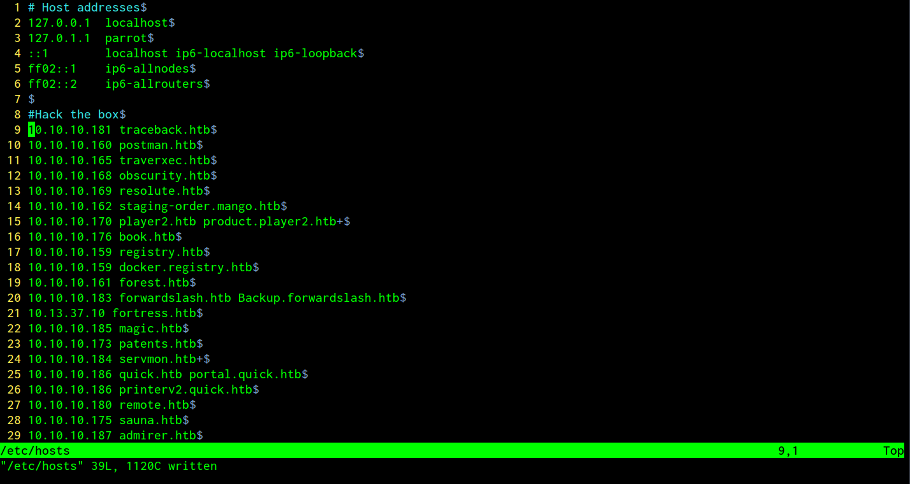

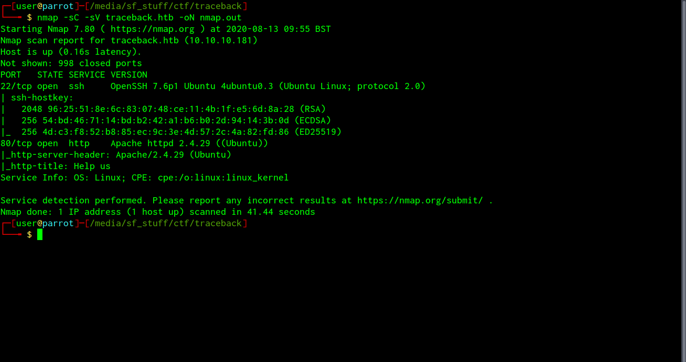

2. We see ports 22 and 80 open ssh and an Apache server respectively. Let's check out the site running on port 80.

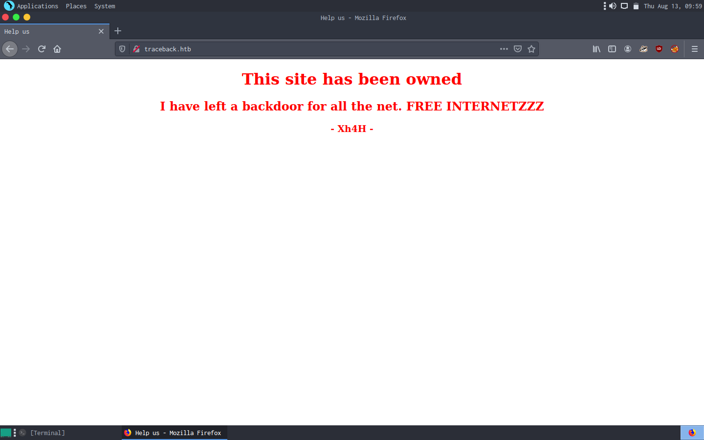

3. The front page seems to be vandalized. Next we can inspect element to look for an attack vector.

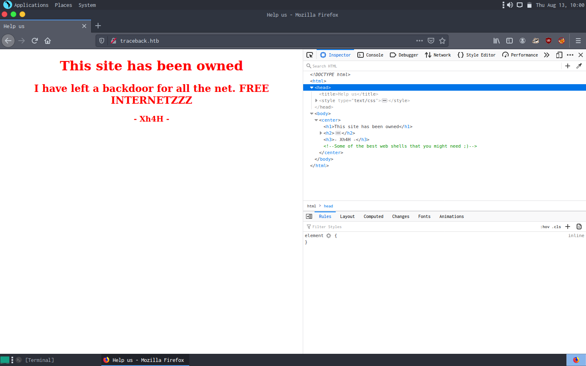

4. There seems to be a clue "_Some of the best web shells that you might need ;)_" left by the vandal hinting at the presence of a hidden web shell. This suspiciously looks like the title of a top ten list medium article so the next step would be to google the clue as is.

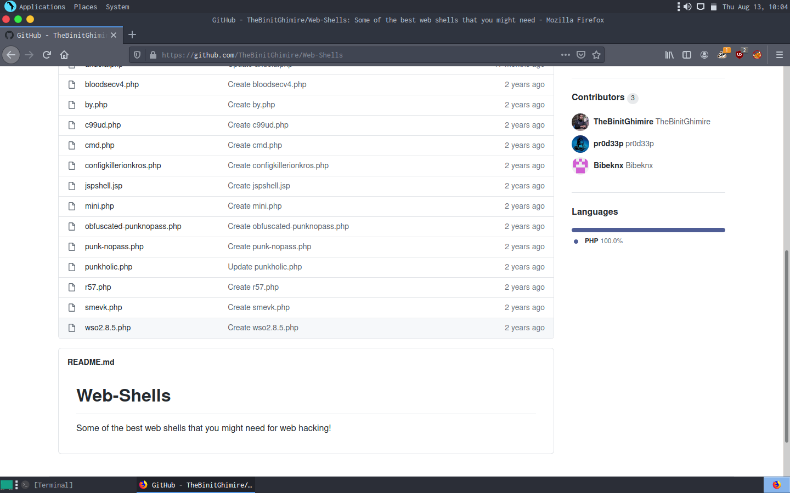

5. Bingo! The first hit is a github page with a list of webshells. Now let's check whether any http://traceback.htb/webshell-name exists with every name on the list (we could script this but the list isn't too long so this could be the better path). If this approach does not work we will try to fuzz subdirectories with the directory-list-2.3-medium wordlist.

6. http://traceback.htb/smevk.php which is in the list, is present! A login prompt shows up in which I try the default admin:password and admin:admin combinations. admin:admin (username and password both admin) grants me access.

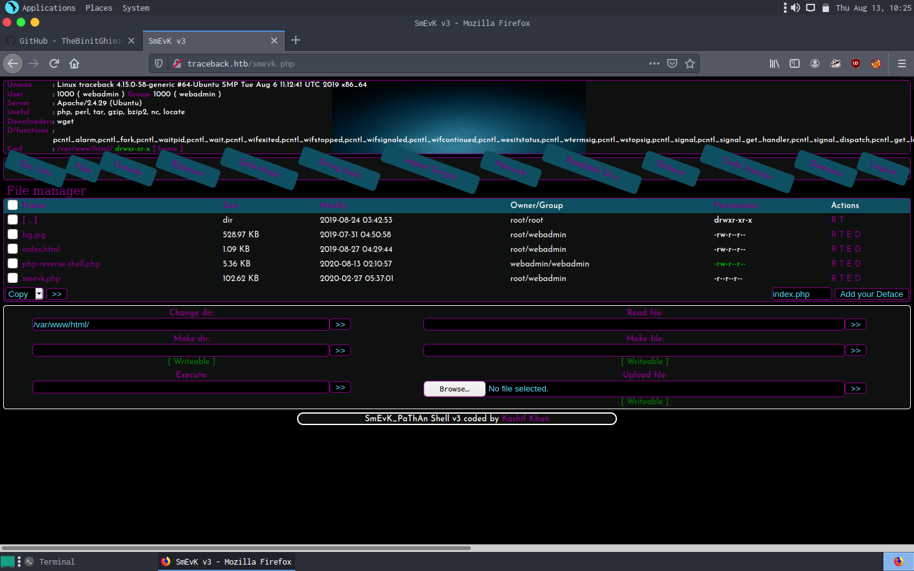

7. Running whoami reveals we are webadmin. Then doing `ls /home` we see there are two users webadmin and sysadmin. /home/webadmin does not have user.txt so we must traverse laterally by owning sysadmin. For now let's focus on enumeration.

8. Running sudo -l to reveal our hidden powers, we see that we can run something called luvit with sudo as sysadmin without password. Also in webadmin's home we see a note.txt which explains that luvit is some sort of a lua interpreter.

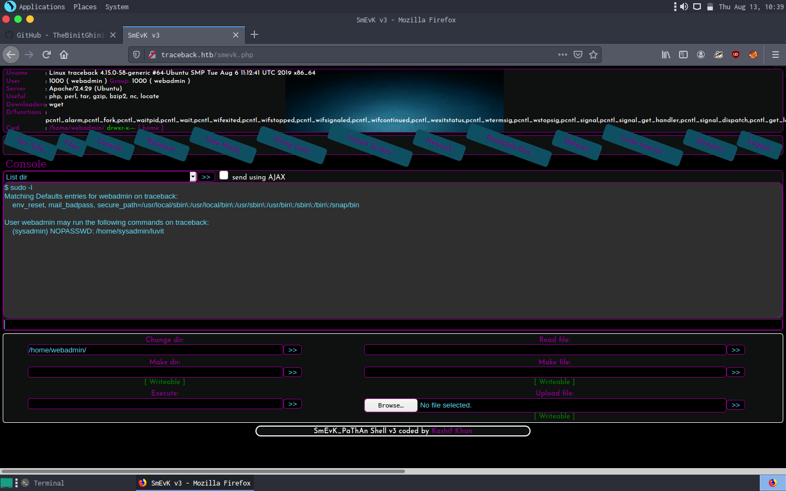

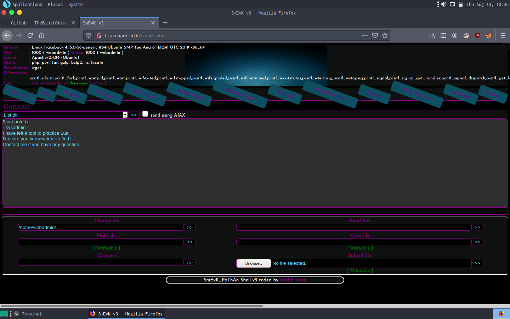

9. This webshell is quite limiting as it is not possible to run something interactive such as an interpreter in it. Hence I decided to use a php reverse shell from this point onward. (Always upload your reverse shells in a nested directory inside somewhere like /tmp to avoid polluting the system and getting in others's way). Then I upgrade my prompt using `python3 -c 'import pty;pty.spawn("bash")'` which also gives me su and sudo -u functionality. Now let's execute `sudo -u sysadmin /home/sysadmin/luvit -h` to weigh our options.

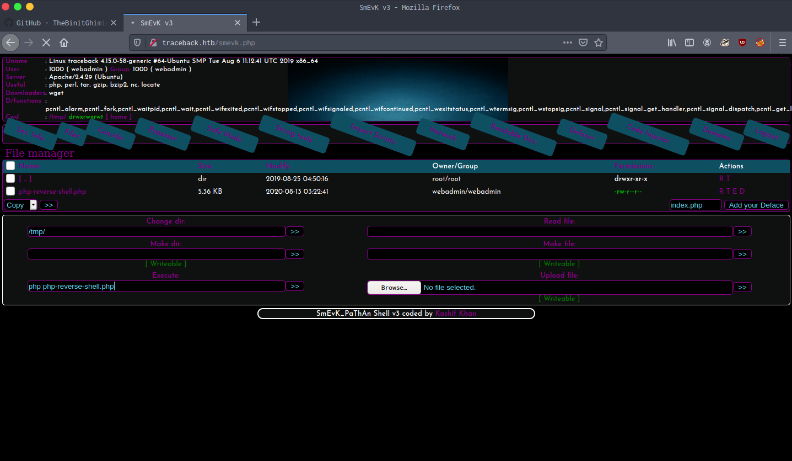

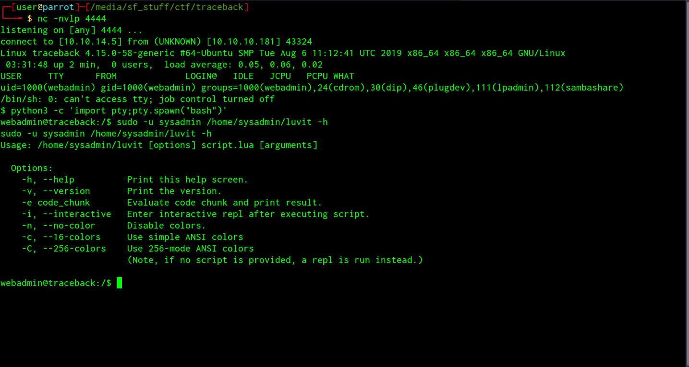

10. There seems to be a '-e' option to execute scripts from the sudo command itself (similar to how we used -c in python to upgrade our prompt).So we can do `sudo -u sysadmin /home/sysadmin/luvit -e 'os.execute("/bin/bash")'` to own sysadmin.

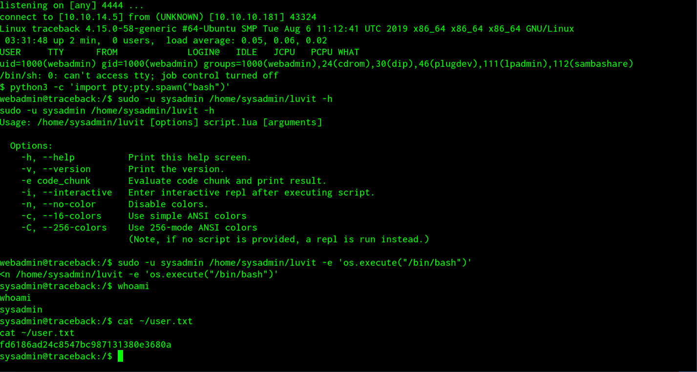

#ROOT

1. Sysadmin is allowed ssh access. To make use of it simply generate public and private key using ssh-keygen **on your local machine** and append the generated public key in traceback's /home/sysadmin/.ssh/authorized_keys. Then do `chmod 600 id_rsa` on your local machine and finally `ssh -i id_rsa sysadmin@traceback.htb` to login.

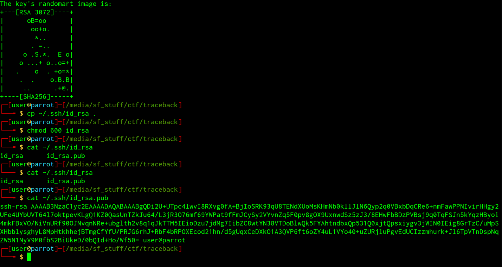
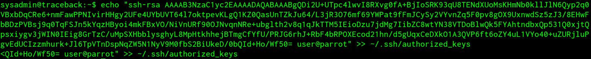
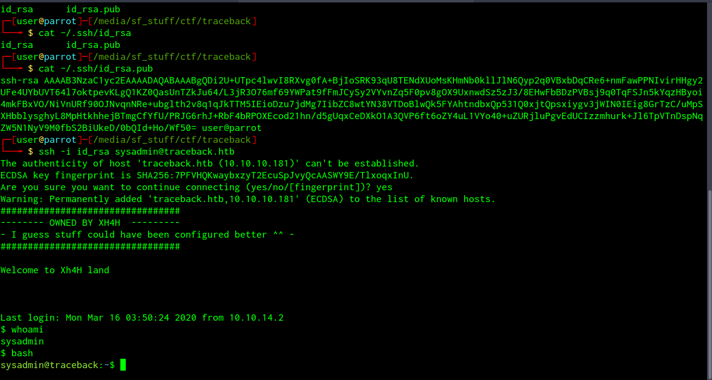

2. Now we can start root enumeration in our cozy ssh. Uploaded linpeas for privesc enumeration. Did not give much info so sent over pspy64 to examine running processes.

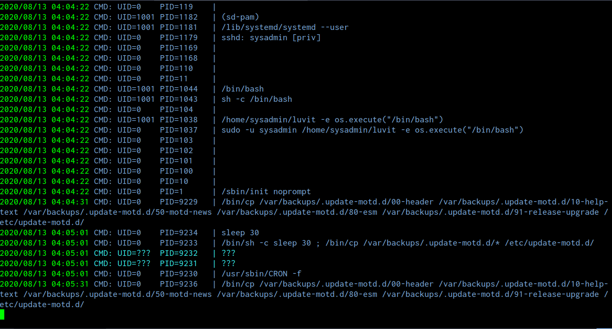

3. Root seems to be restoring motd files every 30 seconds. Motd files store the messages that are displayed when you connect to ssh before the shell is spawned, also viewing permissions on these files reveals that they are writable by me as sysadmin, which is quite unusual. This made me a little curious and on a hunch I opened a second terminal tab and logged into ssh while keeping pspy running in the first. And as suspected, root seems to be executing the motd files upon every login.

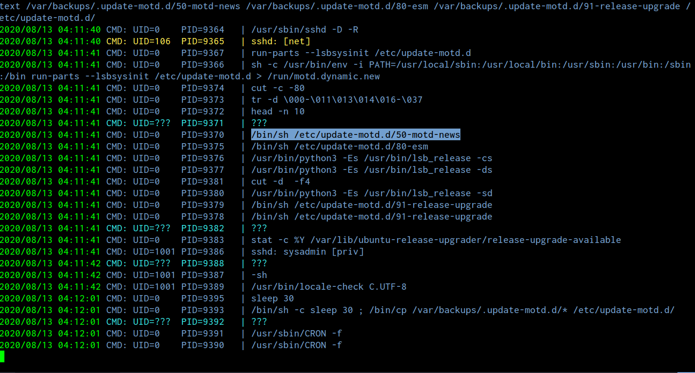

4. The next steps are obvious. We simply **insert a line to cat the public key generated by ssh-keygen into /root/.ssh/authorized_keys in one of the motd files** and open another ssh session. This should append our key into root's authorized keys and we can use the same id_rsa to login to ssh as root!

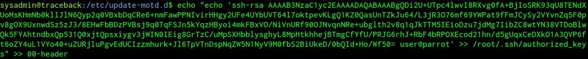
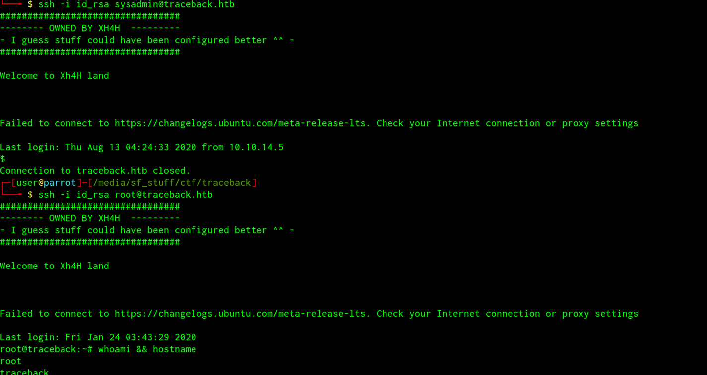

